# FRED API — U.S. Unemployment Rate Analysis

This report explains the results and visualizations generated in the notebook `fred_unemployment.ipynb`.  
The data is retrieved from the [FRED API](https://fred.stlouisfed.org/) and shows U.S. unemployment trends from 2013 to the present.

---

## 1. API Response Structure

The notebook sends a request to the FRED API using a provided API key and retrieves the unemployment data in JSON format.

**Key parts of the response:**
- `date`: Timestamp of each data point
- `value`: Unemployment rate at that date
- `realtime_start` and `realtime_end`: Metadata (typically not used for visualization)

Screenshot: Raw JSON response from the API_  
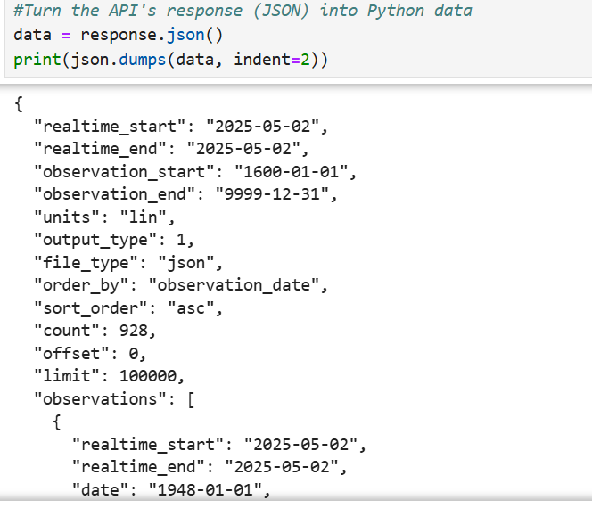

---

## 2. Data Processing

The notebook loops through the response data and extracts two lists:
- `x_dates`: List of dates
- `y_values`: List of corresponding unemployment rate values

These are converted to appropriate data types (`datetime` and `float`) for plotting.

📷 _Screenshot: Output of parsed lists (dates and values)_  
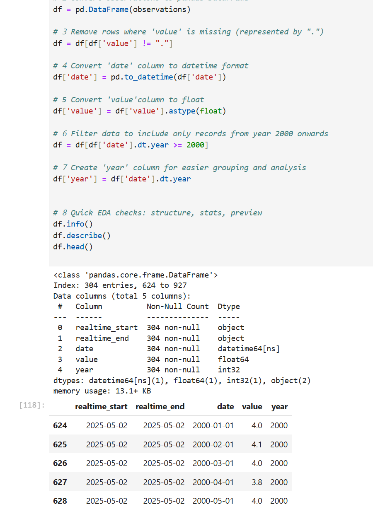

---

# 3. Visualizations and Insights — FRED Unemployment Notebook

This section provides detailed explanations for each graph generated in the analysis of U.S. unemployment data from the FRED API.

---

## 1️⃣ Boxplot — Distribution of Unemployment Rate (2000+)

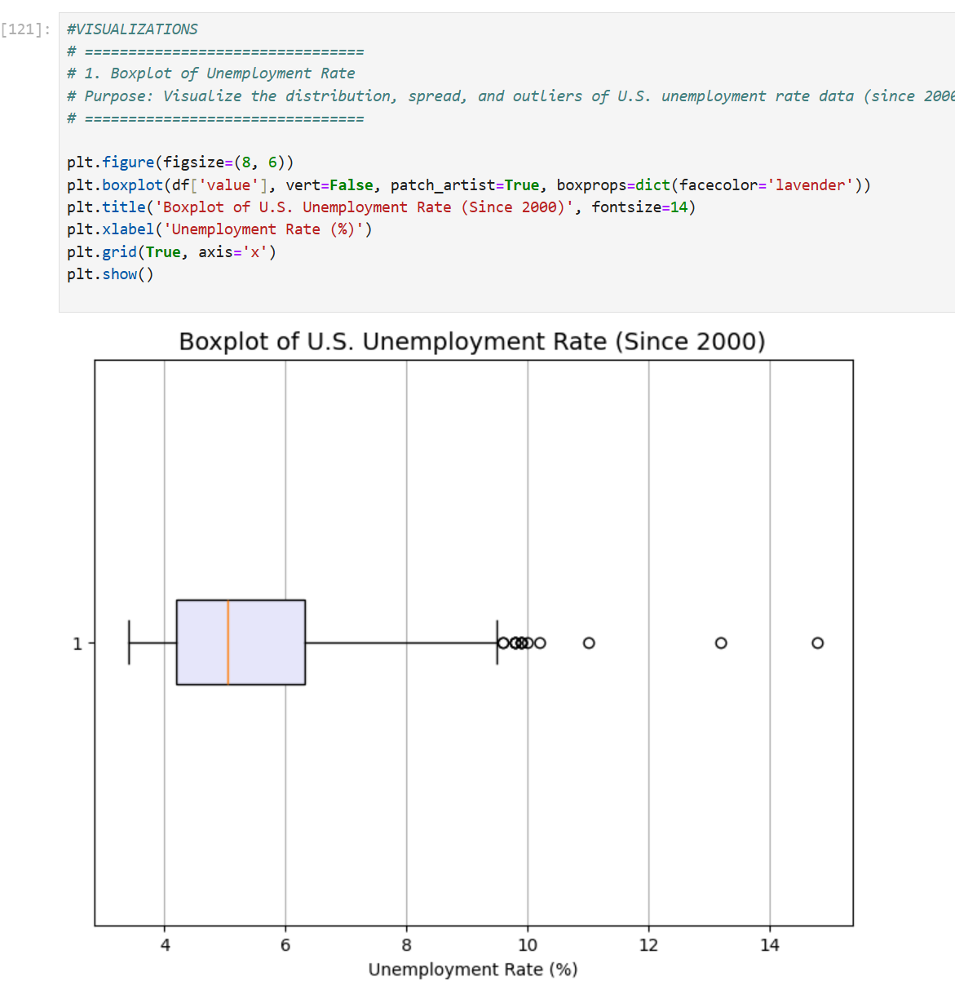

**Purpose:**  
To visualize the spread and outliers in U.S. unemployment rates since the year 2000.

**Insights:**
- Most unemployment rates fall between **4% and 8%**.
- A noticeable **outlier spike** represents the 2020 pandemic surge (~14.7%).
- The boxplot helps identify variability and the typical range of economic conditions.

---

## 2️⃣ Line Plot — U.S. Unemployment Rate Over Time

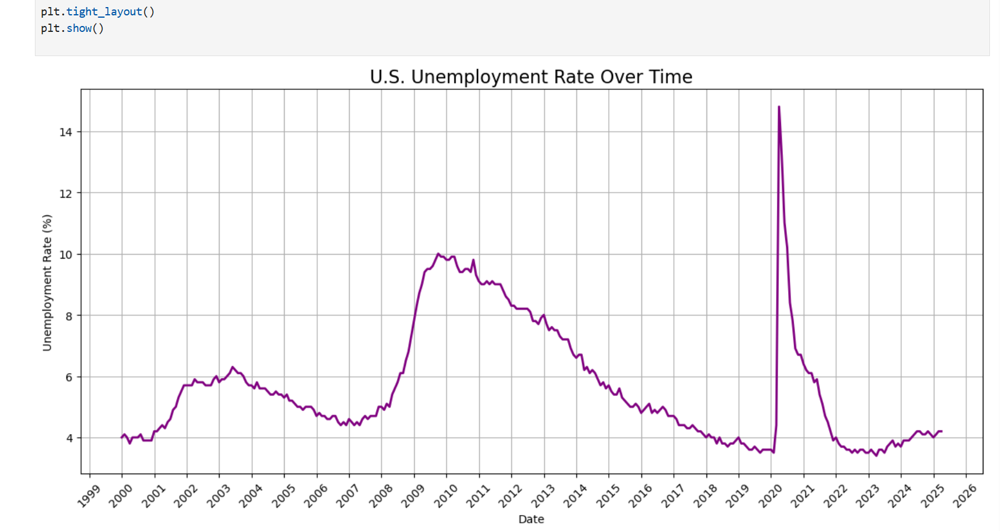

**Purpose:**  
To track monthly unemployment trends from 2000 to the present.

**Insights:**
- Steady employment from 2010–2019, around 4%.
- **Sharp spike in 2020**, due to COVID-19 lockdowns.
- Gradual recovery observed post-2020, nearing pre-pandemic levels by 2022–2023.

---

## 3️⃣ Histogram — Distribution of Unemployment Rates

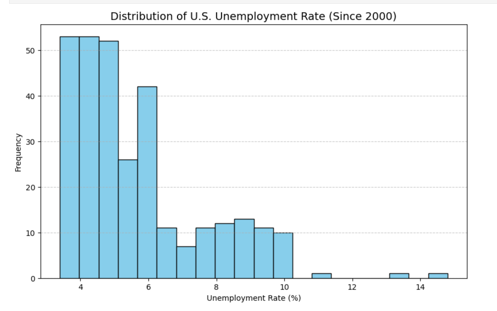

**Purpose:**  
To see how often various unemployment rates occurred.

**Insights:**
- Most values are concentrated between **3.5% and 6%**.
- The distribution is **right-skewed**, influenced by the 2020 spike.
- Helps visualize historical economic stability and deviations.

---

## 4️⃣ Moving Average Plot — Trend Smoothing

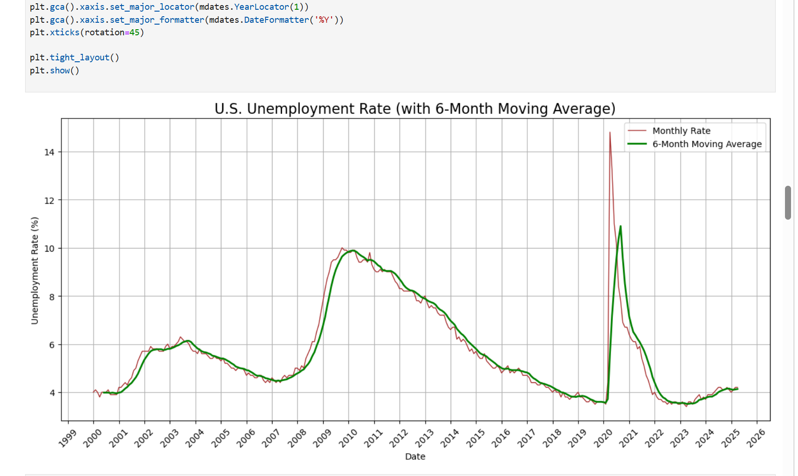

**Purpose:**  
To smooth short-term fluctuations using a **6-month moving average**.

**Insights:**
- Moving average (green) line filters out noise, making long-term trends clearer.
- Confirms long-term stability post-2009, a spike in 2020, and recovery.

---

## 5️⃣ Yearly Average Plot — Annual View of Unemployment

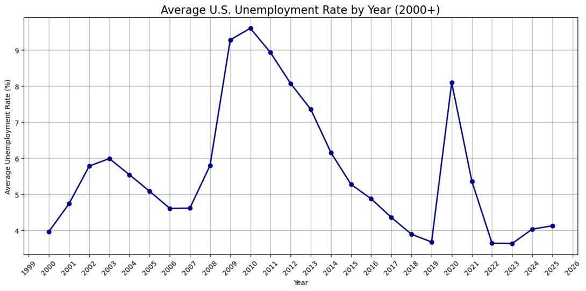

**Purpose:**  
To compare **average unemployment** by year.

**Insights:**
- 2009–2010 had elevated averages due to the financial crisis.
- 2020 shows a visible spike again.
- Recent years show a return to pre-crisis stability (~3.6%).

---

## 6️⃣ Decade-wise Average Plot

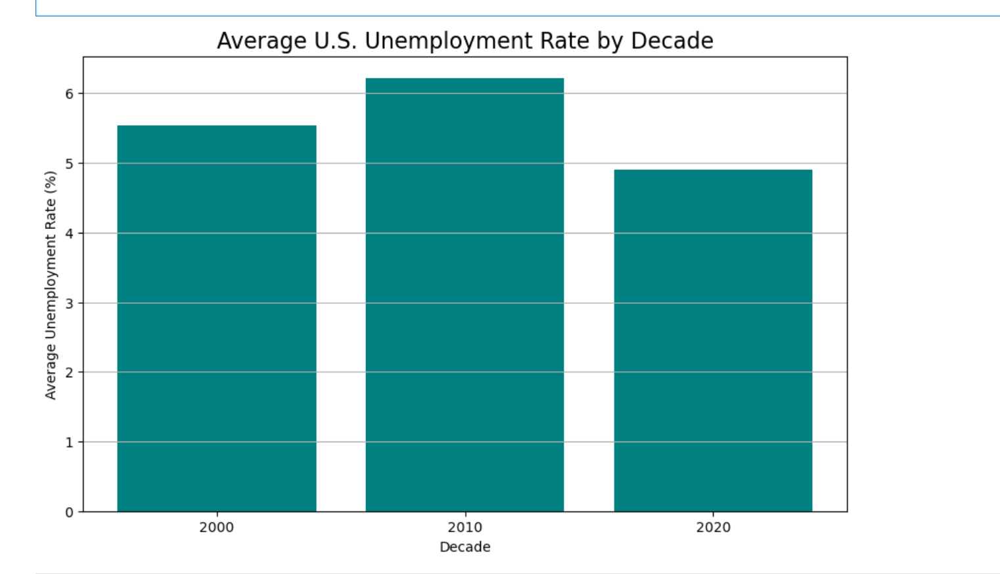

**Purpose:**  
To observe long-term trends by decade.

**Insights:**
- 2010s had a lower average compared to the 2000s.
- This reflects stronger job market recovery and growth across the 2010s, despite the 2020 spike.

---

## 7️⃣ Combined Line Plot — Unemployment vs. CPI (Inflation)

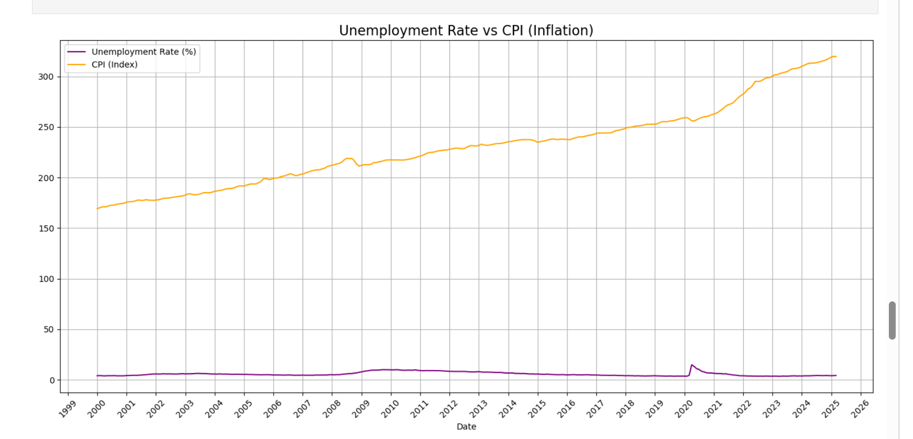

**Purpose:**  
To explore if unemployment and inflation are related (e.g., the Phillips Curve theory).

**Insights:**
- CPI (orange) and unemployment (purple) sometimes move independently.
- There’s **no strong short-term inverse correlation**.
- A modest correlation (~0.2) exists but isn't consistent enough to generalize.

---

## 8️⃣ Scatter Plot — Inflation Rate vs. Unemployment Rate (Phillips Curve)

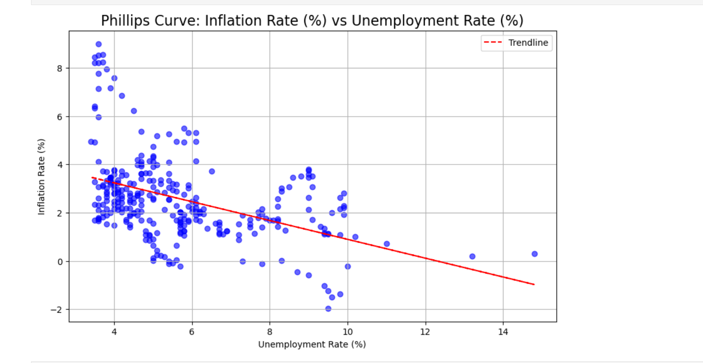

**Purpose:**  
To test the **Phillips Curve** hypothesis: inverse relationship between inflation and unemployment.

**Insights:**
- The scatter plot suggests **weak or no clear negative correlation**.
- A trendline (red dashed) shows a slight downward slope, but the scatter is wide.
- Real-world economic behavior is influenced by many external factors beyond this 1:1 theory.

---

## 9️⃣ Forecast Plot — 12-Month Unemployment Rate Forecast

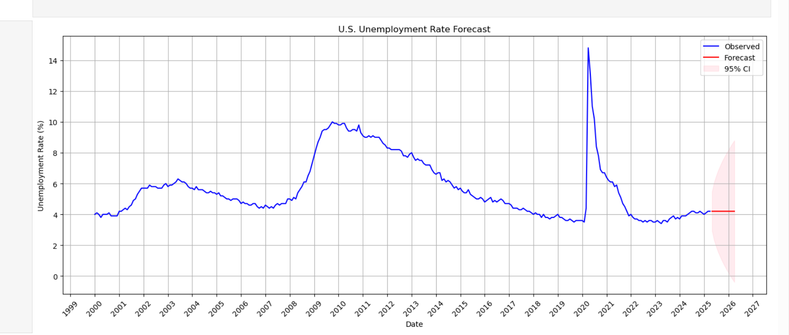

**Purpose:**  
To forecast unemployment using the **SARIMAX model** (ARIMA(1,1,1)).

**Insights:**
- The blue line shows observed values; the red line shows forecasted unemployment.
- The pink shaded area is the **95% confidence interval**.
- Forecast predicts mild fluctuations but overall stable unemployment in the coming year.

---

All screenshots are stored in the `images/` folder for easy rendering in this report.
